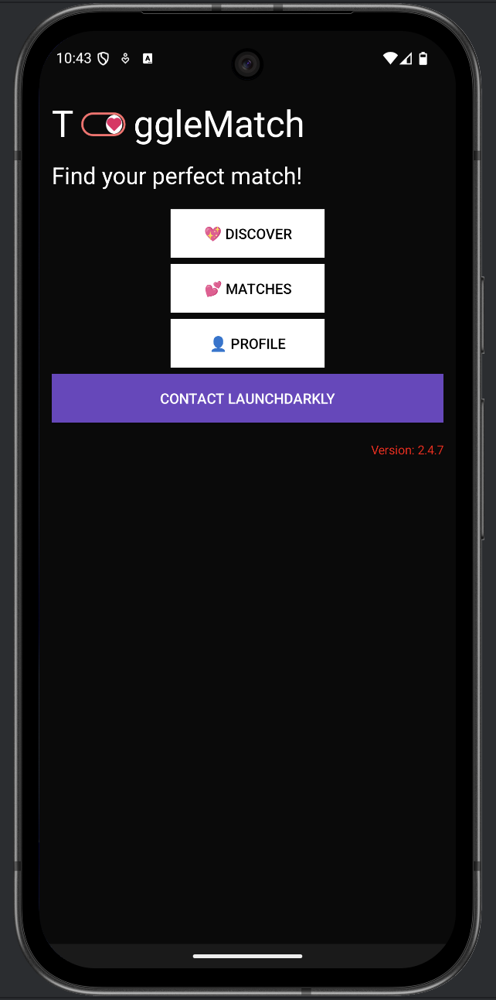
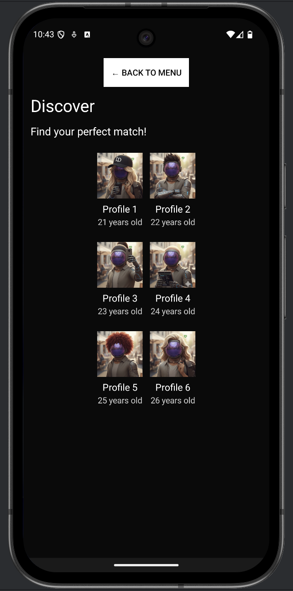

# ToggleMatch 🔥 - Android Kotlin Dating App

A dating app built with native Android Kotlin featuring a sleek dark theme and intuitive swipe functionality to showcase LaunchDarkly feature flags.


## 📱 Screenshots

The app features two main screens:

### Main Screen


### Profile Match


## 🛠 Tech Stack

- **Language**: Kotlin
- **UI Framework**: Android Views with ViewBinding
- **Architecture**: MVVM with ViewModels
- **Dependency Injection**: Hilt
- **Image Loading**: Glide
- **Navigation**: Bottom Navigation
- **Design System**: Material Design 3

## 📁 Project Structure

```
app/src/main/java/com/togglematch/
├── data/
│   └── model/              # Data models
│       └── Profile.kt
├── ui/
│   ├── discover/          # Discover screen
│   │   ├── DiscoverFragment.kt
│   │   └── DiscoverViewModel.kt
│   ├── matches/           # Matches screen
│   │   ├── MatchesFragment.kt
│   │   ├── MatchesAdapter.kt
│   │   └── MatchesViewModel.kt
│   └── profile/           # Profile screen
│       ├── ProfileFragment.kt
│       └── ProfileViewModel.kt
├── MainActivity.kt
└── ToggleMatchApplication.kt
```

## 🚀 Getting Started

### Prerequisites

- Android Studio (latest version)
- Android SDK 24+ (Android 7.0+)
- Java 8 or higher
- Kotlin 2.2.0+

### Installation

1. Clone the repository:
```bash
git clone <repository-url>
cd ToggleMatchKotlin
```

2. Open the project in Android Studio

3. Sync the project with Gradle files

4. Run the app on an emulator or device

### LaunchDarkly Configuration

This app uses LaunchDarkly for feature flag management. The SDK is configured with:

- **Mobile Key**: `mob-your-mobile-key`
- **SDK Version**: `com.launchdarkly:launchdarkly-android-client-sdk:4.1.1`

The LaunchDarkly client is initialized in `ToggleMatchApplication.kt` and provides feature flag functionality throughout the app.

#### Current Feature Flags

- **`show-matches`** (Boolean): Controls whether the "Matches" button is displayed on the main screen
  - Default: `false`
  - Used in: `MainActivity.kt` (line 162)
  - When enabled: Shows the Matches button in the main navigation

### Building the App

```bash
# Debug build
./gradlew assembleDebug

# Release build
./gradlew assembleRelease
```

## 📱 Key Features

### ToDo


## 📦 Dependencies

- **AndroidX**: Core Android libraries
- **Material Design**: Material Design 3 components
- **Hilt**: Dependency injection
- **Glide**: Image loading and caching
- **Navigation**: Fragment navigation
- **Lifecycle**: ViewModel and LiveData

## 🧪 Testing

```bash
# Run unit tests
./gradlew test

# Run instrumented tests
./gradlew connectedAndroidTest
```

## 📄 License

This project is licensed under the MIT License - see the LICENSE file for details.

---
